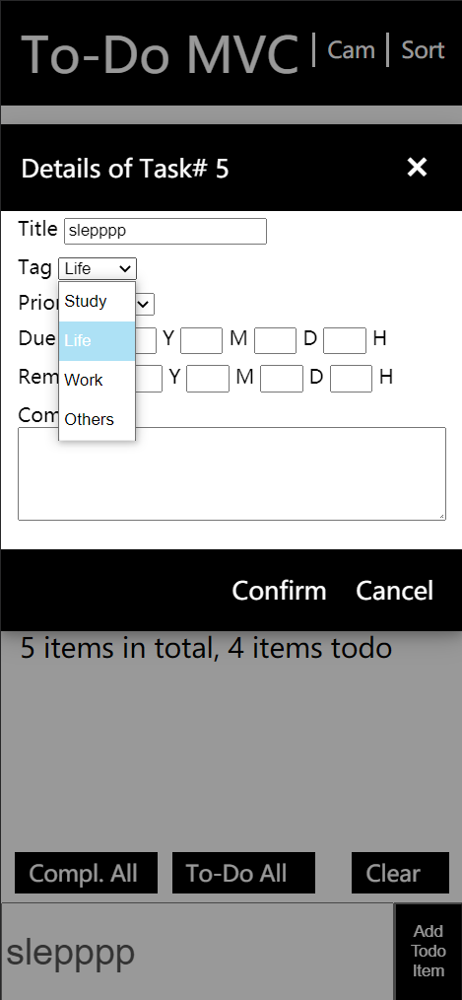
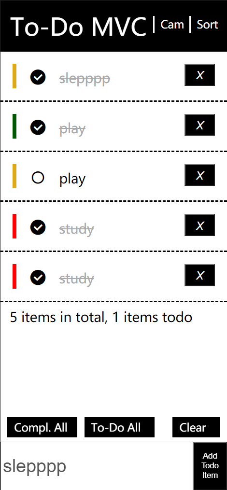
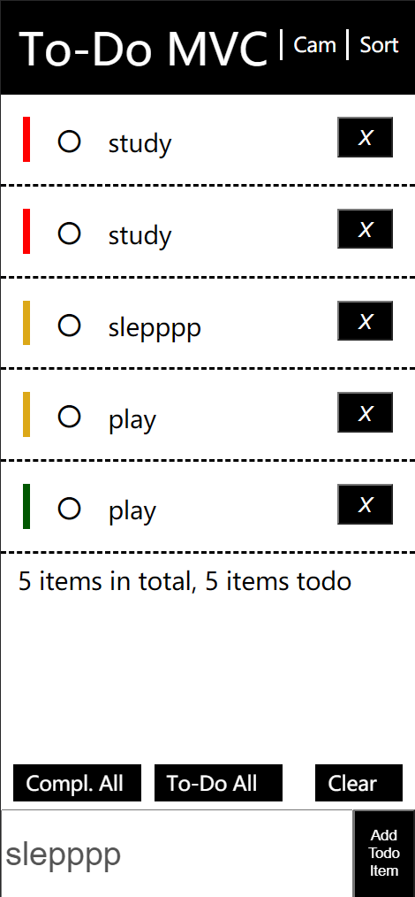
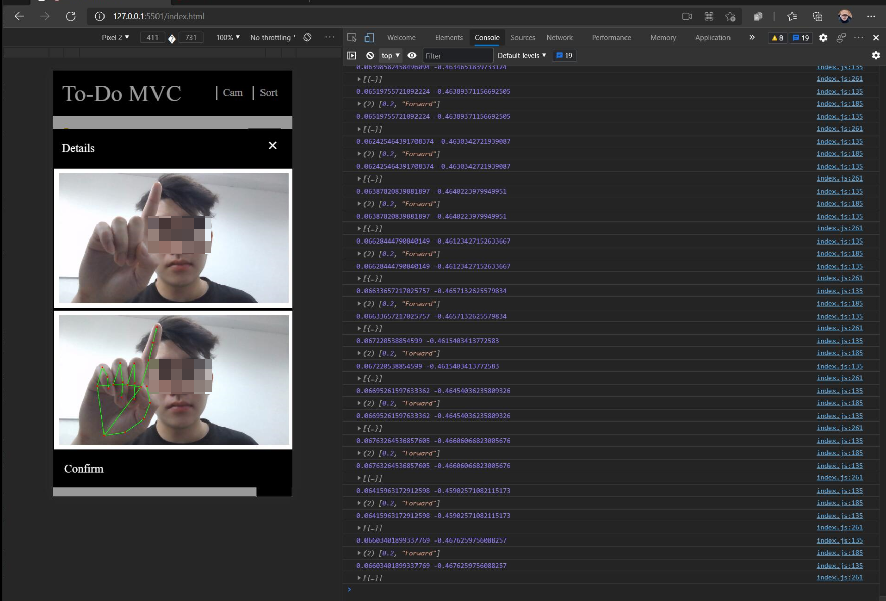

## 📱脚本程序设计期末项目：手机版ToDoMVC

github 地址：https://github.com/LeeJAJA/TodoMVC
部署地址（Netlify）：https://eager-saha-beb760.netlify.app

### 🤔基本功能
- 展示：可显示所有的ToDo Task，当展示内容较多时可以上下浮动，滑动时功能性按钮的位置会保持不变。

- 增加：在下方文本框内输入文字即可编辑task的title，点击Add即可添加。

- 删除单条todo：用手指点击X键可删除。

- 全部完成/取消：点击左下角 Compl. All 可全部完成，点击左下角 To-Do All 可全部取消。

- 数据持久化：使用localstorage存储数据，刷新页面后可恢复。

###  🧠高级功能

- Task 长按交互：长按任务条可以弹出详情框，可以编辑任务的详细信息。包括 Title，Priority，Due，Remind Point 和 Comment 等。此数据均可持久化。
- 排序：可以点击右上角的 Sort 对当前所有任务进行顺序/逆序排序（以优先级为关键字）。
- 优先级指示：在每项任务条的左侧分别用绿色，橙色和红色指示任务的优先级，分别对应 Low，Med 和 High。
- 批量完成：用户点击 Clear All 可清空全部完成项。
- 计算机视觉手势识别（于前端实现）：使用 MediaPipe 实现，通过在 js 中计算各个关节的角度，做到用户可以点击屏幕上方的 Cam 预览手势识别的效果。对着摄像头分别摆出手势“1”，“2”和“3”等价于按下 “Compl. All”， “To-Do All” 和 “Clear All”。
- 输入智能预测（于前端实现）：使用 ml5.js 的 CharRNN 模型基于用户当前输入预测其下一步将输入的文字。当 focusin 输入栏时会弹出一个黑色提示区，用于显示提示文字。

### 🌟示意图
- 编辑详细信息

  

- 优先级指示

  

- 排序后的效果

  

- 输入智能预测

- 手势识别

  
